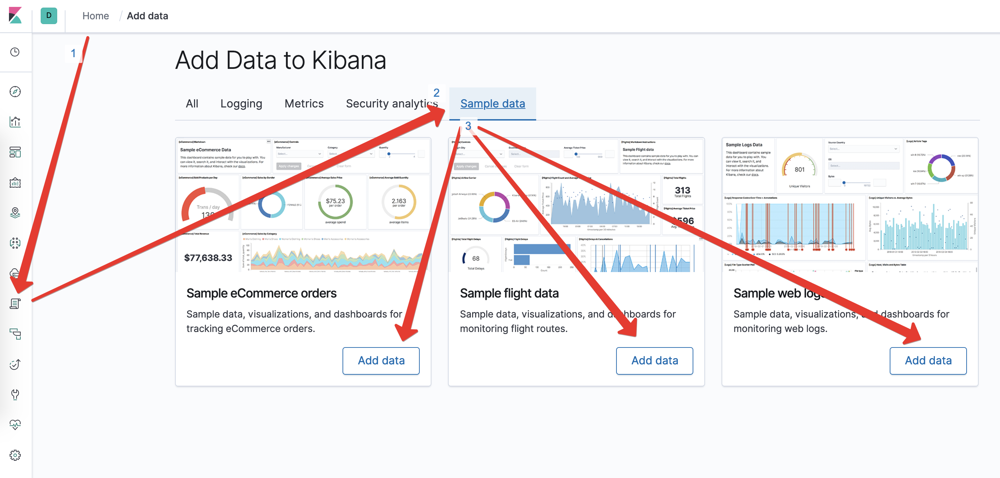

# Kibana
## Загрузка тестовых данных 
Для того чтобы ознакомиться с функционалом kibana, нам нужен будет какой-то набор данных, а еще лучше уже готовые дашборды и графики. В kibana есть три тестовых набора данных которые сильно облегчают процесс ознакомления. Загрузить тестовые наборы данных можно через web-интерфейс в kibana

## Дополнительная информация
Чтобы получить большее представление о том какие возможност есть в kibana могу рекомендовать видео на английском, но даже если вы не очень хорошо владеете языком, в видео ценны кейсы которые показывают по работае с kibana https://www.youtube.com/watch?v=mMhnGjp8oOI. Несколько демонстраций свежих фич из последних версий https://www.youtube.com/watch?v=q9R7r4ncaPY. 