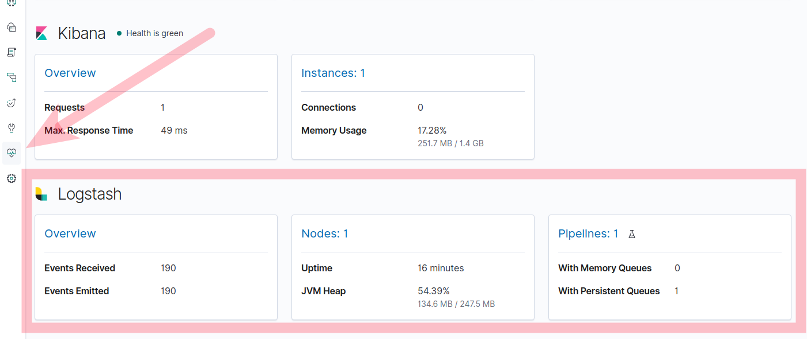

# Конфигурация logstash
Конфигурация logstash состоит из нескольких [файлов](https://www.elastic.co/guide/en/logstash/7.0/config-setting-files.html):
* logstash.yml - основная конфигурация logstash
* pipelines.yml - конфигурация pipeline (расположение файлов кофигураций наших pipeline, кол-во воркеров, настройки очередей и пр. параметры глобальный на каждый pipeline) 
* jvm.options - параметры JVM на которой работает logstash и все ваши pipeline в нем (настройки HEAP, garbage collector и пр.)
* log4j2.properties настройки логирования. В нашем примере файла нет, т.к. используются настройки по умолчанию

## logstash.yml
Cписок всех доступных параметров для logstash можно смотреть [по ссылке](https://www.elastic.co/guide/en/logstash/7.0/logstash-settings-file.html). 
В нашем случае заданы след. настройки:
* ```http.host:0.0.0.0``` - logstash будет слушать все интерфейсы внутри контейнера, т.е. REST API logstash будет доступен на всех IP адресах контейнера. В docker-compose.yaml мы указали что нужно пробросить порт контейнера на порт хостовой машины (localhost:9600)
* ```xpack.monitoring.enabled``` и ```xpack.monitoring.elasticsearch.hosts``` - параметры для включения мониторинга встроенного в xpack. В случае успешной настройки можно отслеживать некоторые параметры работы logstash через kibana. 

* ```queue.type: persisted``` - задаем хранение очередей записей/событий logstash приобработке на диске во временных файлах. По умолчанию очереди храняться в памяти что не является надежным. Подробнее про очереди по [ссылке](https://www.elastic.co/guide/en/logstash/current/persistent-queues.html). Реализации очередей есть в двух вариантах в памяти или в локальных файлах.
* ```config.reload.automatic: true``` - задаем автоматическую перезагрузку logstash при изменении файлов конфигурации logstash. Параметр приемущественно нужен для удобства этапе разработки и отладки, т.к. полный рестарт logstash занимает значительное время. 
    Сразу стоит отметить, автоматическая перезагрузка logstash работает только при изменении или удалении файлов конфигурации pipeline (то что находится в директории ./pipelines/*) которые существовали на момент запуска logstash. Автоматическое применение конфгов не будет работать в случае добавления нового файла конфигурации или изменении файлов logstash.yml, pipelines.yml, jvm.options и log4j2.properties. 

## jvm.options
Зная что мой текущий pipeline не будет требователен к ресурсам, я ограничил HEAP 256 mb:
```
-Xms64m
-Xmx256m
```

## pipelines.yml
```pipeline.id: main``` - уникальный идентификатор нашего pipeline в рамках текущего logstash 
```path.config``` - директория с конфигурационными файлами нашего pipeline, logstash подключает все файлы в директории
```queue.type: persisted``` - тип очереди для нашего pipeline. Можем выбрать, важно ли нам сохранение состояний работы нашего pipeline в случае остановки logstash или делаем упор на скорость работы и указываем значение ```memory```. 

## Конфигурация pipline
Конфигурация текущего pipeline храниться в файле pipeline/main/hello.conf. Далее мы разберем содержимое этого файла и подробнее рассмотрим за что отвечает каждый из параметров. 

### Вводная в конфигурацию
В конфигурации pipeline может быть три секции которые можно ассоциировать с этапами ETL:
* ```input { ... }``` - этап получения данных (E - extract), источник данных для нашего pipeline. Внутри этого блока может быть задано несколько источников. Большой плагинов для получения данных из разных источников доступен по [ссылке](https://www.elastic.co/guide/en/logstash/7.0/input-plugins.html)
* ```filter { ... }``` - этап фильтрации, трансформации или обогащения данных (T - transform). Список плагинов позволяющих раелизовать достаточно широйкий спектр задач доступен по [ссылке](https://www.elastic.co/guide/en/logstash/7.0/filter-plugins.html). Блок может отсутствовать, как в нашем случае
* ```output { ...  }``` - этап записи данных в хранилище или в другое место назначения (L - load). Список плагинов для разных задач доступен по [ссылке](https://www.elastic.co/guide/en/logstash/7.0/output-plugins.html) . Результат работы pipeline можно отправить в несколько мест назначения, например в stdout и в хранилище или пустить на обработку через другой pipeline на том же logstash.

Плагины можно писать под любые задачи, пишутся на ruby, т.к. сам logstash написан на JRuby.

### Логика нашего pipeline
Наш демо pipeline реализует логику: 
1. Раз в 5-ть секунд logstash создает сообщение "Hello from Logstash" и пропускается по своему pipeline
    Определяется поведение блоком input:
  ```
  input {
       heartbeat {
           interval => 5
           message  => 'Hello from Logstash'
       }
   }
  ```
  Плагин [heartbeat](https://www.elastic.co/guide/en/logstash/7.0/plugins-inputs-heartbeat.html) реализует логику отправки сообщения с текстом указанным в поле message раз в n-секунд (```interval => 5```). Удобен исключительно для тестирования и отладки pipeline.
2. Полученное сообщение выводим в консоль в читаемом виде. Чтобы посмотреть только логи нашего logstash нужно в текущей директории выполнить команду ```docker-compose logs --tail 0 -f logstash```. Подождав 5-ть секунд увидим примерно след. вывод и сообщения будут добавляться:
    ```
    $ docker-compose logs --tail 0 -f logstash
    logstash_1   | {
    logstash_1   |       "@version" => "1",
    logstash_1   |           "host" => "144db88146e7",
    logstash_1   |        "message" => "Hello from Logstash",
    logstash_1   |     "@timestamp" => 2019-03-24T18:45:43.894Z
    logstash_1   | }
    logstash_1   | {
    logstash_1   |       "@version" => "1",
    logstash_1   |           "host" => "144db88146e7",
    logstash_1   |        "message" => "Hello from Logstash",
    logstash_1   |     "@timestamp" => 2019-03-24T18:45:48.894Z
    logstash_1   | }
    ```
    Логика вывода определяется в блоке output:
	```
	output {
		stdout { codec => rubydebug }
    }
	```
	[stdout](https://www.elastic.co/guide/en/logstash/7.0/plugins-outputs-stdout.html) тоже является плагином, в качестве параметра указан кодек ```rubydebug``` который выводит данные в консоль в читаемом виде и со служебными полями, на которые можно писать условия обработки. Кодеки тоже являются плагинами, список кодеков можно посмотреть по [ссылке](https://www.elastic.co/guide/en/logstash/7.0/codec-plugins.html) . Если заменить [rubydebug](https://www.elastic.co/guide/en/logstash/7.0/plugins-codecs-rubydebug.html) на кодек [line](https://www.elastic.co/guide/en/logstash/7.0/plugins-codecs-line.html), то сообщение будет выведено без доп. полей и форматирования.
3. Кроме вывода в stdout,  pipeline пишет данные в elasticsearch в индекс newprolab-heartbeat. Посмотреть его содержимое мы можем в kibana или выполнив команду ```curl "http://localhost:9200/newprolab-heartbeat/_search?pretty"```. Результат будет примерно такой:
	```
	$ curl "http://localhost:9200/newprolab-heartbeat/_search?pretty"
	{
      "took" : 3,
      "timed_out" : false,
      "_shards" : {
        "total" : 1,
        "successful" : 1,
        "skipped" : 0,
        "failed" : 0
      },
      "hits" : {
        "total" : {
          "value" : 2,
          "relation" : "eq"
        },
        "max_score" : 1.0,
        "hits" : [
          {
            "_index" : "newprolab-heartbeat",
            "_type" : "_doc",
            "_id" : "zPUNsWkBCTG2l6hRKzSA",
            "_score" : 1.0,
            "_source" : {
              "@version" : "1",
              "host" : "144db88146e7",
              "message" : "Hello from Logstash",
              "@timestamp" : "2019-03-24T18:53:42.238Z"
            }
          },
          {
            "_index" : "newprolab-heartbeat",
            "_type" : "_doc",
            "_id" : "zfUNsWkBCTG2l6hRNzSe",
            "_score" : 1.0,
            "_source" : {
              "@version" : "1",
              "host" : "144db88146e7",
              "message" : "Hello from Logstash",
              "@timestamp" : "2019-03-24T18:53:47.237Z"
            }
          }
        ]
      }
    }
    
	```
	За запись данных в elasticsearch отвечает блок конфигурации output-плагина [elasticsearch](https://www.elastic.co/guide/en/logstash/7.0/plugins-outputs-elasticsearch.html):
    ```
    elasticsearch {
		hosts => [ 'http://elastic-1:9200', 'http://elastic-2:9200' ]
		index => "newprolab-heartbeat"
	}
    ```
    В блоке мы задаем адреса наших нод elasticsearch(```hosts```) и индекс куда должны писаться данные текущего pipeline(```index```)

